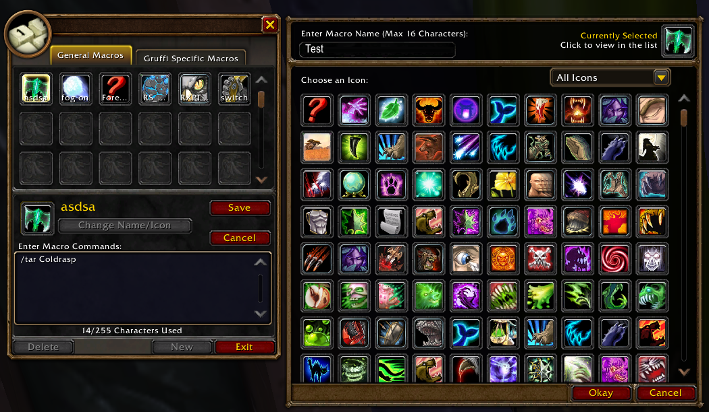
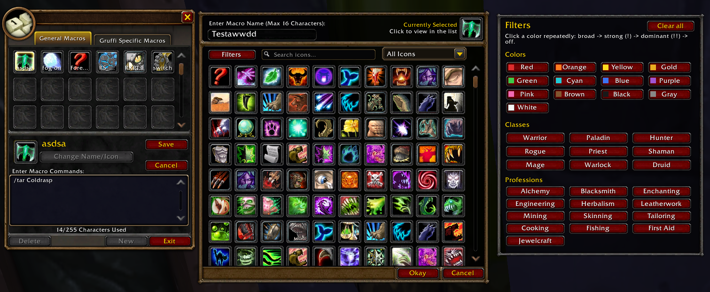

# Macro Icon Search für WoW: Forever

**Macro Icon Search** erweitert die normale Makro-Icon-Auswahl von WoW: Forever um eine schnelle Suche und komfortable Filter.

Statt tausende Icons durchzuscrollen, kannst du direkt nach Namen, Farben, Klassen und Berufen suchen und mehrere Filter miteinander kombinieren.

> **Aktuelle stabile Version:** 2.10.3  
> **Eingebetteter Forever-Iconbestand:** 27.714 Icons

[English README](README.md)

## Vorher / Nachher

### Vorher
Die normale Makro-Icon-Auswahl von WoW: Forever.



### Nachher
Macro Icon Search ergänzt die Makro-Icon-Auswahl direkt um Suchleiste, Farbfilter, Klassenfilter, Berufsfilter und eine schnelle Navigation durch die Ergebnisse.



## Funktionen

- Schnelle Textsuche, z. B. `fire`, `sword`, `shadow`, `bear`
- Farbfilter auf Basis tatsächlich analysierter Icon-Pixel
- 13 Farben: Rot, Orange, Gelb, Gold, Grün, Cyan, Blau, Lila, Pink, Braun, Schwarz, Grau, Weiß
- Drei Farbstärken: normal, stark (`!`) und dominant (`!!`)
- Klassenfilter für alle neun unterstützten Klassen
- Berufsfilter inklusive Juwelenschleifen
- Mehrere Filter lassen sich mit UND-Logik kombinieren
- Rechtsklick setzt einen einzelnen Filter zurück
- Seitenwechsel per Mausrad
- Unterstützung für **All Icons / Spells / Items**
- Automatisch deutsche oder englische Oberfläche
- Für möglichst geringe FPS-Auswirkungen optimiert

## Beispiele

```text
fire
green!
green!!
Green + Druid + bear
Blue + Mage + frost
Red + Warrior + sword
```

## Farbfilter

Ein Farbbutton wechselt bei wiederholtem Linksklick zwischen:

```text
Normal -> Stark -> Dominant -> Aus
```

Ein Rechtsklick setzt nur diesen einzelnen Farbfilter zurück.

## Seitennavigation

In gefilterten Ergebnissen:

- Mausrad runter = nächste Seite
- Mausrad hoch = vorherige Seite
- `<` und `>` funktionieren weiterhin
- Unten wird die aktuelle Seite und die Trefferzahl angezeigt

## Datenbestand

| Daten | Anzahl |
|---|---:|
| Makro-Icons insgesamt | 27.714 |
| Spell-Icons | 2.688 |
| Item-Icons | 25.026 |
| Aufgelöste Dateinamen | 27.409 |
| Nicht aufgelöste Dateinamen | 305 |
| Icons mit Pixelfarbdaten | 27.355 |
| Icons ohne Pixelfarbdaten | 359 |

Der exakte eingebettete Iconbestand wurde aus **Forever Build 70205** exportiert.

## Installation

1. Die aktuelle ZIP herunterladen.
2. Entpacken.
3. Der Addon-Ordner muss `MacroIconSearch` heißen.
4. Den Ordner hierhin kopieren:

```text
World of Warcraft/
└── Interface/
    └── AddOns/
        └── MacroIconSearch/
```

5. Spiel starten oder `/reload` benutzen.
6. Makrofenster öffnen und ein Icon auswählen.

## Wichtige Befehle

```text
/mis help
/mis status
/mis colors
/mis names
/mis lost
/mis exact
/mis coverage
/mis stats green
/mis perf
```

## Performance

Schnellfilter verwenden vorberechnete Ergebnislisten. Kombinierte Filter arbeiten auf kleinen statischen Teilmengen, und die Textsuche nutzt einen vorberechneten 2-/3-Zeichen-Index.

Dadurch muss bei normalen Suchvorgängen nicht jedes Mal der komplette Bestand von 27.714 Icons durchsucht werden.

## Keine externe Software notwendig

Das Addon läuft als normales Lua-Addon. Es benötigt keine EXE-Dateien, DLL-Injection, Speicherzugriffe, Eingabe-Automatisierung oder Hintergrundprogramme.

Die Icon- und Farbdaten wurden vorher offline erzeugt und werden als statische Daten mitgeliefert.

## Fehler melden

Bei einem Fehler bitte ein GitHub Issue öffnen und möglichst Folgendes angeben:

- verwendete Suche bzw. aktive Filter
- erwartetes Verhalten
- tatsächliches Verhalten
- Lua-Fehlermeldung, falls vorhanden
- bei Performanceproblemen die Ausgabe von `/mis perf`

## Lizenz

Aktuell wurde noch keine Open-Source-Lizenz ausgewählt. Bis eine Lizenz hinzugefügt wird, gelten die normalen Urheberrechtsregeln.

## Hinweis

Dieses Projekt ist ein Community-Addon und steht nicht in Verbindung mit Blizzard Entertainment. World of Warcraft und zugehörige Bezeichnungen sind Marken ihrer jeweiligen Rechteinhaber.

## Benennung der Versionen

Alle fertigen ZIP-Versionen verwenden ab jetzt dieses Namensschema:

```text
MacroIconSearchForever_v.X.XX.x.zip
```

Beispiel:

```text
MacroIconSearchForever_v2.10.3.zip
```
